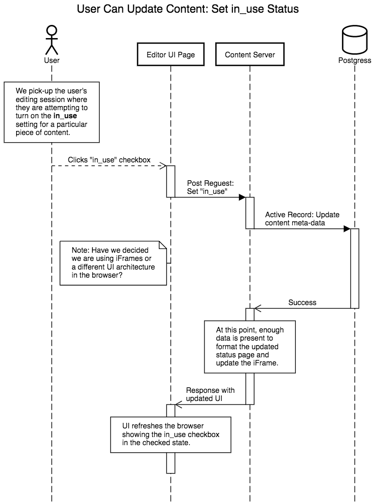
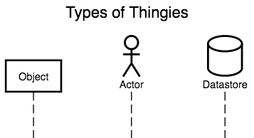
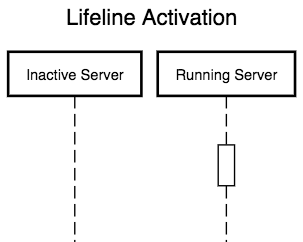
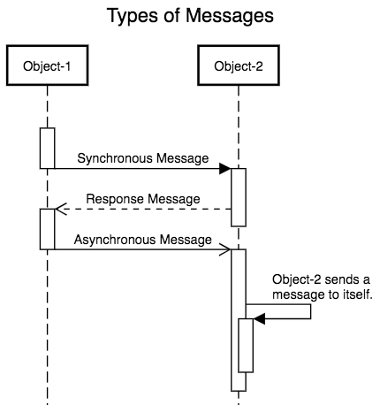
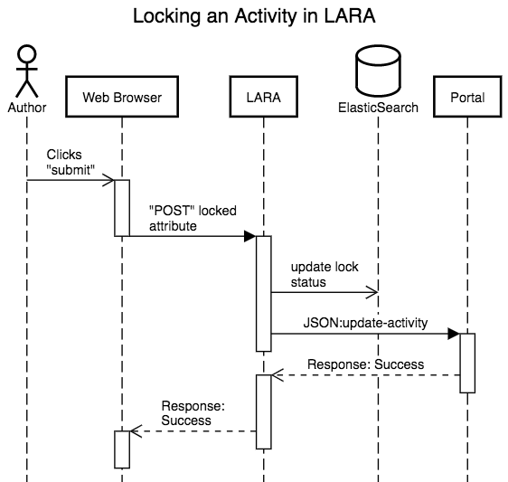
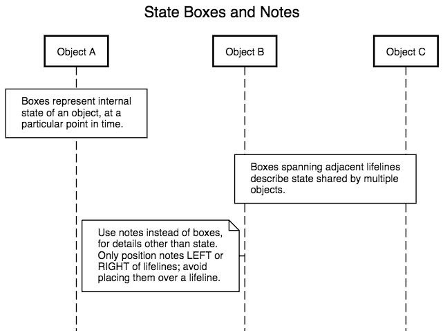
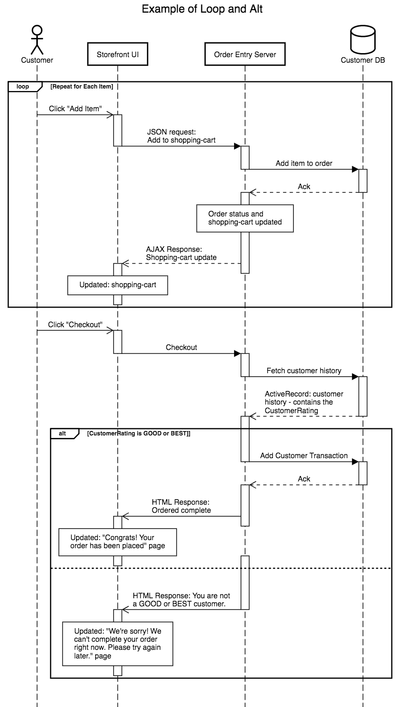
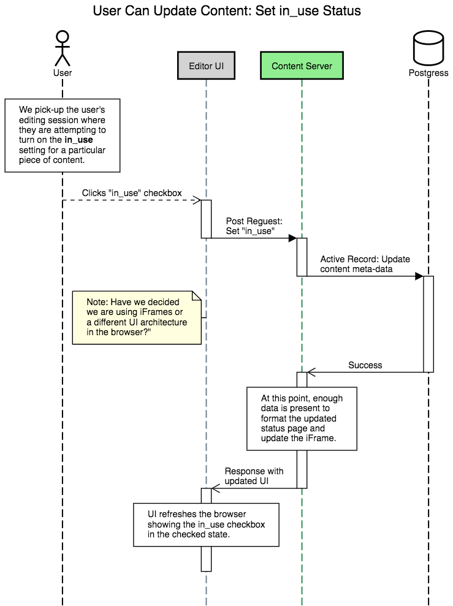

# Sequence Diagrams

Sequence Diagrams, sometimes called Event Diagrams or Interaction Models, are depictions of active _thingies_ (objects, agents, actors, servers, processes, etc.) that interact by passing _stuff_ (messages) between each other. 

These diagrams are particularly useful because they directly represent the passage of time as you move down the diagram.

## 1. Introducing Sequence Diagrams

To provide some motivation, here is an example sequence diagram that might have been part of a user story called "User Can Update Content". Such a user story might have several use-case scenarios which can become fairly complex but are, nevertheless, very important to understanding exactly what happens. This diagram might have been used to capture how a particular use-case, "Set in_use Status" might be designed.



As I hope is evident from this example, the diagram clearly communicates the essence of the use-case. Because of this clarity, sequence diagrams are a valuable way to explore, communicate, and precisely capture use-cases that might arise while discussing a user story.

In addition, because they are simple to draw (particularly on a whiteboard) and straightforward to understand, a complex user story might use a half-dozen or more sequence diagrams to convey edge conditions and test scenarios.

But, there are a couple of problems with sequence diagrams. First, although they are easy to draw by hand, they are kind of hard to draw by computer. And Second, the full and formal conventions of sequence diagrams is more complicated than is required for our purposes.

## 2. A Drawing Tool

Trying to draw a sequence diagram with a general purpose drawing program is pretty time consuming. Although, they are pretty quick to draw on a whiteboard! 

> **Hint:** I have often sketched a sequence digram during a conversation and photographed the result on the whiteboard with my phone. Although this is less than satisfying for remote meetings, in face-to-face collaborations, it's a great for rapidly fleshing out the details of a use-case or testing scenario.

Lucky for us, there's a tool available for drawing these pretty diagrams. Check out the free web tool, [Sequence Diagram]. This tool converts a textual description into a PNG, SVG, or JPG graphic suitable for pasting into a document or a user story. It's a little creaky; but, it gets the job done.

> **Recommended:** Navigate to [Sequence Diagram] and click the  button icon, in the upper-left corner. This will show you all the bells and whistles.

In addition to generating the pretty pictures, the [Sequence Diagram] tool also provides a WYSIWYG editor. Most of these diagrams started out by "drawing" with the mouse. After that, the diagrams were polished by some hand-edits to the source text. This turns out to be pretty fast for creating an acceptable diagram.

## 3. A Useful Subset of Sequence Diagram Conventions

The formal definition of the sequence diagram notation grew out of the UML software engineering tools fad of the mid 1990's. Many conventions were adopted and rigorously defined; however, most of these conventions are overkill for our purposes.

This document, describes a useful subset of the notation and the relevant textual representations used in [Sequence Diagram].

> **Note:** Keep in mind that the simpler the set of conventions we adopt, the more understandable the diagrams will be to the widest possible audience. This document only shows the few sequence diagram elements I think we need to provide the most value.

## 4. We Need Some _Thingies_

The _thingies_, the objects that send/receive messages, run across the top of the diagram. There are three types of _thingies_ that are most often used:

* An _object_, also known as a _participant_, which are drawn as boxes with a heavy border.

* An _actor_, a little stick figure, which have a role, and usually represent a user performing a very specific and particular set of actions.

* A _datastore_, also known as a _database_, which are data storage systems and are kind of self explanatory.

<center>

</center>

Participants (objects) are the catch-all _thingie_ and can be used to represent pretty much anything. The [Sequence Diagram] tool uses the keyword `participant` and does not have a keyword for object. This document will tend to use the word _participant_ and _object_ (and _thingie_, for that matter) interchangeably.

Keep in mind, this is a very general notion of an object -- it could be a "class", as is used in an object-oriented programming language; an entire sub-network of computers; some specialized piece of hardware like a sensor; or really, anything that has the ability to send and/or receive messages.


> **Best Practice:** Although there are several more types of objects, these three, the object, the actor, and the datastore, are the most important and all the rest are best ignored. Only use [Sequence Diagram]'s `participant`, `actor` and `database` verbs to define our _thingies_.

Each one of these has a lifeline that is represented by a dashed line running down the diagram. When a _thingie_ is actively doing something, like executing some code, the lifeline is changed from a dashed line to a narrow, vertical box. This is known as _activating_ the object.

<center>

</center>

> **Hint:** Activations can often clarify a diagram but the gist of the sequence can usually be understood without them. I rarely take the time to draw them on a whiteboard, but I usually add them to more formally prepared diagrams. They should be treated as an optional notational convention.

## 5. Making _Thingies_ Talk

Horizontal arrows represent messages being set from one _thingie_ to another _thingie_. There are some subtle differences in the styling of the arrows that have utility when capturing a "conversation" between _thingies_.

The exact conventions for what, exactly, the line styles mean have changed over the years. For this reason, this document suggests a small set of meanings that have worked well in practice.

|       Symbology        || Meaning & Usage                |
|:-----:|-----------------|--------------------------------|
| ⎯⎯⎯⎯⎯⎯⎯⎯⎯  | Solid Line      | Ordinary message               |
| ⎯⎯ ⎯⎯ ⎯⎯ | Dashed Line     | Response to a previous message | 
|   ▶︎   | Solid Arrowhead | Synchronous; the sender blocks |
| **>** | Open Arrowhead  | Asynchronous                   |

> **Note:** A response message, from a receiver back to the sender is almost always a dashed line with an open arrowhead. 

Given two line styles and two arrowhead styles, we have four possible combinations; however, only three of these are used in common practice.

The following shows an example of all three plus the very special _synchronous message to self_. This technique is used to detail something like a sub-routine call that is significant to the user-case.

<center>

</center>

## 6. An Example

Let's put what we've just discussed together using a fictional sequence of messages, between semi-fictional thingies. Let's start with the [Sequence Diagram] source description.

``` text
# All diagrams should have a title. If possible, try to title
#  . the diagram relative to a user story, so as to provide
#  . some context. Titles, in SequenceDiagram.org, don't look
#  . like they support newlines or styling -- keep 'em short,
#  . keep 'em simple.

title Locking an Activity in LARA

# Kind of nice to create all the thingies at the top of the
#  . diagram.

actor Author
participant Web Browser
participant LARA
database ElasticSearch
participant Portal

# Let's start by having the user send a message by clicking
#  . on a button in the UI. Somewhat, by convention, messages
#  . originating from humans are asynchronous because we don't
#  . really know if they care to look at the result.

Author->>Web Browser:Clicks\n"submit"

# The browser creates a request it will sent to LARA that is
#  . a server waiting for HTTP requests.

activate Web Browser
Web Browser->LARA: "POST" locked\nattribute
deactivate Web Browser

# When LARA gets the POST message from the browser, activates,
#  . sends a an asynchronous message to ElasticSearch, then a
#  . synchronous message to the Portal server, and blocks.

activate LARA
LARA->>ElasticSearch:update lock\nstatus
LARA->Portal:JSON:update-activity
deactivateafter LARA

# The Portal handles the request and responds back to LARA,
#  . which is blocked and waiting for the response message.

activate Portal
Portal-->>LARA:Response: Success
deactivateafter Portal

# And finally, LARA receives the response and finishes up.

activate LARA
LARA-->>Web Browser:Response:\nSuccess
deactivateafter LARA

activate Web Browser
```

That bit of script produces this diagram:

<center>

</center>

Pretty cool, eh?

> **Best Practice:** There are many more things you can do with messages, but once again, less is more. You can model most real-world interactions with just these 3 message types.

## 7. State Boxes and Notes

The diagrams shown so far show the _thingies_ and all the _stuff_ that passes between them. All that is pretty useful, but our sequence diagrams become much more descriptive when we can attach information to our lifelines. This information comes in the form of _state boxes_ and _notes_.

**State Boxes**

Since the state of an object changes over time, usually, in response to messages it has received, sequence diagrams capture these states by a box that is drawn over the lifeline of the object. These boxes can also be extended to span across more than one (adjacent) object's lifeline to indicate a state that is shared or synchronized in time.

Similarly, notes are attached to lifelines, at particular points in time, and are indicated with the "turned-down-corner" box shape. The note should never appear over or spanning a lifeline, but rather, to the side of a lifeline.

> **Best Practice:** Although several different shapes, for example, rounded boxes, are supported by [Sequence Diagram], using more than just simple rectangular boxes can confuse a diagram by suggesting the shapes convey something special about the state. 

> Avoid anything but rectangular state boxes. Further, [Sequence Diagram] also supports positioning the state box adjacent to the lifeline. This too, should be avoided. In other words, only position state annotations in 1) rectangular boxes, that are 2) positioned over, or spanning lifelines.

> The contents of a state box should be a declarative statement describing only those things pertinent to the state of the object.

> **Note:** Please note that the [Sequence Diagram] tool doesn't allow statements to break across lines. For this reason, the trailing \\ character is used in the C-style line continuation syntax, although this isn't recognized by the tool.

``` text
title State Boxes and Notes

box over Object A:Boxes represent internal\nstate of an \
object, at a\nparticular point in time.

box over Object B,Object C:Boxes spanning adjacent lifelines\n \
describe state shared by multiple\nobjects.

note left of Object B:Use notes instead of boxes,\nfor details \
other than state.\nOnly position notes LEFT or\nRIGHT of \
lifelines; avoid\nplacing them over a lifeline.
```

In this diagram we see the internal state of object A, and a common state of objects B and C, represented by boxes. Each state box contains a description of the state.

<center>

</center>

These two conventions makes it a lot easier to understand how an objects state changes over time, and to distinguish information notes and comments.

## 8. Fragments

If you've made it this far, bravo! This section describes _fragments_ (as in "fragments of time") which are used to group a bunch of consecutive interactions into a block of time, and giving that block a special meaning or condition. The most important of these, are the "alt" and "loop" fragments. The "alt", lets us capture a type of `if/then` concept in our interactions. The "loop" let's us diagram, well, loops!

**Hint:** Fragments start to make sequence diagrams more difficult to comprehend. We recommend using only `alt` and `loop` fragments; and then, only sparingly. Often, it's easier to make two sequence diagrams, labeled and noted appropriately, as if they were two separate use-cases.

Here, we have an example diagram with both a loop-fragment and an alt-fragment, all in one sequence diagram. In the source that follows, only the parts specific to the loop and alt fragments is included.

``` text

# First, the "loop" fragment.

loop Repeat for Each Item
  Customer->>Storefront UI:Click "Add Item"
  activate Storefront UI
  ⋮
  box over Storefront UI:Updated: shopping-cart
  deactivateafter Storefront UI
end

# Now we have the part in the middle, starting with clicking the
# . "Checkout" button.

Customer->>Storefront UI:Click "Checkout"
activate Storefront UI
⋮
activate Customer DB
Order Entry Server<<--Customer DB:ActiveRecord: customer\nhistory - contains the\nCustomerRating

# And now, we have the "alt" fragment.

alt CustomerRating is GOOD or BEST]
  Order Entry Server->Customer DB:Add Customer Transaction
  deactivate Order Entry Server
  ⋮
  activate Order Entry Server
else
  Storefront UI<<-Order Entry Server:HTML Response: \
    You are not\na GOOD or BEST customer.
  activate Storefront UI
  ⋮
  deactivateafter Storefront UI
end
```

<center>

</center>

> **Best Practice:** As you can see, fragments can be useful as a diagramming technique, but at the risk of making the diagrams more challenging to comprehend. Use them when necessary, but avoid them if possible.

## 9. Some Style Concerns

The [Sequence Diagram] tool provides all sorts of little controls for adding style like text-emphasis and color to our diagrams. Mostly, this isn't very useful with just a couple of exceptions, noted here.

_Newlines in text and arrow labels._ This is particularly important for state boxes that have a lot of state to describe. Newlines can reduce the text width so the boxes can be kept narrow enough to fit, nicely, within the diagram. This is particularly important when there are many objects across the page which tends to make the diagram very busy.

> **Hint:** As a rough guideline, use a newline every 20 or so characters. Generally speaking, this "line length" can be a good starting point and will get you a reasonably presentable diagram.

_Color for objects and lifelines._ Color, generally, doesn't help a lot; but, it can be effective in helping to identify the same object over multiple, related sequence diagrams. For this to work, of course, the same color for the same object must be consistent from diagram to diagram.

> **Hint:** When using the _Sequence Diagram_ tool, it seems to look better to set all lifelines width a little bit thicker when using color.

> Further, if you want to add color to an object, pick a good color for the object and play around with related colors for the lifeline that are reasonably legible in the document.

Here is an example.

``` text
# Make the lifelines a little thicker
# . for better ledgibility when we
# . add color.

lifelineweight 2

# Define our objects, their color, and
# . a complimentary color for their
# . lifelines

actor Customer #blue
lifelinecolor Customer #blue

participant Storefront UI #lightgray
lifelinecolor Storefront UI #slategray

participant Order Entry Server #lightseagreen
lifelinecolor Order Entry Server #seagreen

database Customer DB
... # The rest, removed for brevity.
```



In other words, and generally speaking, don't bother getting fancy. It makes editing existing sequence diagram scripts more difficult and it makes the reader wonder what, if anything, a particular style is supposed to mean.

## 10. Summary

Let's recap this bare-bones approach to sequence diagrams. We have:

* Using a tool, we have a fast way of drawing machine readable (and therefore source-control friendly), not to mention editable, sequence diagrams. Consider drawing some on a whiteboard first, and then trying to capture in the tool, later. You might find this the fastest process of all, particularly when working in-person.

* We can use them to model objects and their interactions over time to precisely communicate a particular scenario. This can be particularly helpful when nailing down the details of a particular use-case within a user story.

* We have objects, and more rarely actors and databases, to model the _thingies_ in our diagram. They are nearly always at the top of our diagram.

* Each object has a lifeline that represents the passing of time as we follow the lifeline down the page. The lifeline will sometimes be represented as a narrow rectangle to indicate when a object is active.

* Interactions, or messages, are indicated with horizontal arrows from one object's lifeline to another. We have 4 arrow types to represent those interactions:

	* Solid with solid arrowhead represents a synchronous message where the sender is assumed to be blocked until a response message is received;
	* Solid with open arrowhead represents an asynchronous message;
	* Dashed with closed arrowhead usually represents a response to a synchronous message; and,
	* Dashed with open arrowhead represents a message from a user/actor.

* State boxes used to describe what's going on inside an object at a particular moment in time.

* Fragments (short for "fragments in time") that group together a series of interactions and provide a context or condition that applies to those interactions.

* And finally, we have notes for attaching additional information or comments to objects.

By restricting ourselves to just these concepts that are embodied in a sequence diagram, we have the ability to model, communicate, brainstorm, reason about, and document how the _thingies_ in a system cooperate to accomplish work.


[Sequence Diagram]: https://sequencediagram.org/
